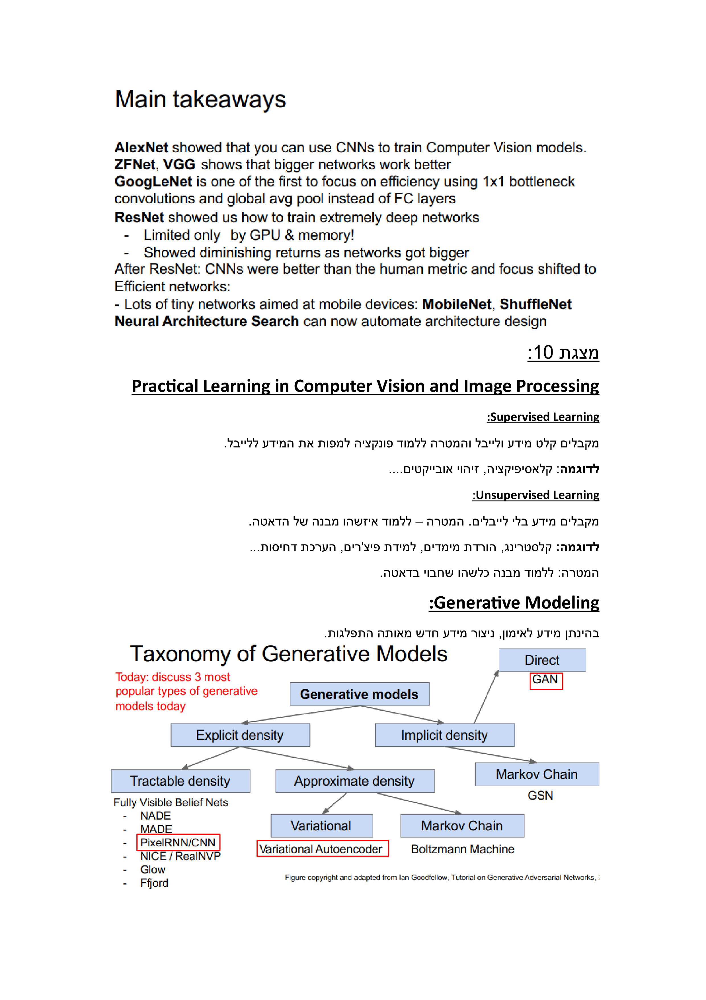
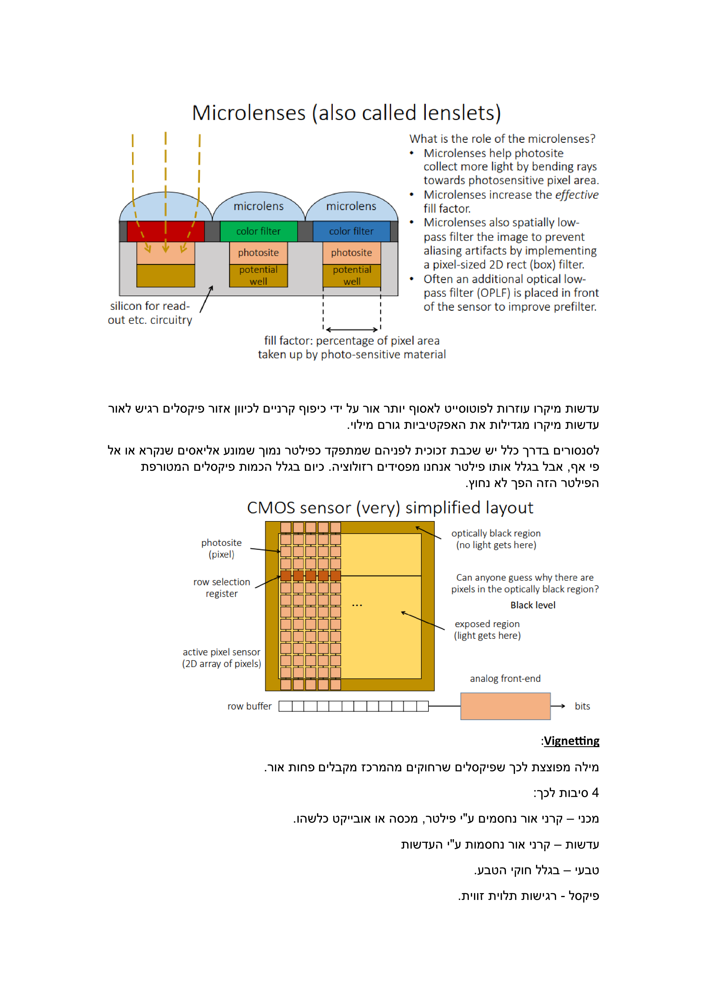

<div align="center">
  <h1>🔬 CS231n & CV7062610: Assignment Solutions & Summary 📚</h1>
  <p><b>Computer Vision Concepts Summary 📷</b></p>
  <p><i>Stanford & Ariel - Spring 2023 🌱</i></p>
</div>

<br/>

### 🌐 Overview

Welcome to the repository containing comprehensive summaries and assignment solutions for **CS231n** at Stanford University (2017) and **CV7062610** at Ariel University (2023). This collection represents a synthesis of my personal insights gained from these courses, in combination with supplementary materials sourced from the internet. **Please note that the summary is presented in a blend of English and Hebrew**. It's important to emphasize that no instructor has reviewed or endorsed this summary. The information provided is founded on my own interpretations.

<br/><br/>

<div align="center">
  <h1>📝 Assignment Solutions</h1>
</div>

<br/>

### Assignment Instructions 🗣️:

- Each assignment folder contains its instructions and my solution.

<br/>

### How To Run 🏃‍♂️:

- It is advised to run in [Colab](https://colab.research.google.com/), however, you can also run locally. To do so, first, set up your environment - either through [conda](https://docs.conda.io/en/latest/) or [venv](https://docs.python.org/3/library/venv.html). It is advised to install [PyTorch](https://pytorch.org/get-started/locally/) in advance with GPU acceleration. Then, follow the steps:


  1. Change every first code cell in `.ipynb` files to:
     ```bash
     %cd CV7062610/datasets/
     !bash get_datasets.sh
     %cd ../../
     ```
  2. Change the first code cell in section **Fast Layers** in [ConvolutionalNetworks.ipynb](assignment2/ConvolutionalNetworks.ipynb) to:
     ```bash
     %cd CV7062610
     !python setup.py build_ext --inplace
     %cd ..
     ```

Additionally, install the requirements specified under each assignment folder.

<br/><br/>

<div align="center">
  <h1>📚 Summary</h1>
</div>

<br/>

### 📖 Key Resources

- **Stanford Lecture videos (2017)** - [📺 Lecture Videos](https://www.youtube.com/playlist?list=PLC1qU-LWwrF64f4QKQT-Vg5Wr4qEE1Zxk)
- **Ariel Lecture Slides (2023)** - Only Students can access that info...
<br/><br/>


<!-- Table of contents -->
### 🗺️🧭🔍 Summary Table of Contents
   * [01. Linear Classifier & Cross Validation](#image-0)
   * [02. Batch Normaliztion (More Details in 15)](#image-1)
   * [03. Optimizations - SGD, Momentun, Nesterov, Adam & Dropout (More Details in 17)](#image-2)
   * [04. Softmax & SVM](#image-7)
   * [05. Analitic Gradient](#image-8)
   * [06. Gradient Descent & Stochastic Gradient Descent](#image-10)
   * [17. Image Features & ConvNets](#image-12)
   * [18. Neural Networks](#image-13)
   * [19. Activation Functions](#image-14)
   * [10. Fully Connected Layer](#image-16)
   * [11. 2-Layer Neural Networks & How To Compute Gradients](#image-17)
   * [12. Convolution Layer](#image-18)
   * [13. Pooling Layer](#image-20)
   * [14. Weight Initialization - Xavier, Kaiming/MSRA](#image-22)
   * [15. Batch Normaliztion (More detailed)](#image-23)
   * [16. Transfer Learning](#image-26)
   * [17. Optimizations (More details)](#image-27)
   * [18. Enhancing CNN Robustness and Generalization - Data Augmentation, Fraction Pooling, Stochstic Depth, Cout & Mixup](#image-33)
   * [19. CNN Architectures - AlexNet, VGGNet, GoogleNet & ResNet](#image-35)
   * [20. GPT](#image-39)
   * [21. DenseNet & Neural Architecture Search(NAS)](#image-40)
   * [22. Practical Learning - Supervised, Unsupervised & Generative Modeling](#image-41)
   * [23. FVBN - PixelRNN & PixelCNN](#image-42)
   * [24. Autoencoders](#image-43)
   * [25. Generative Adversial Networks (GAN's)](#image-45)
   * [26. Pretext Tasks From Image Transformations](#image-48)
   * [27. SimCLR, Moco & CPC](#image-50)
   * [28. Generative Pre-Trained **Transformers** (GPT)](#image-52)
   * [29. Detection & Segmentation](#image-55)
   * [30. Computer Vision & Image Processing - **Sensors**](#image-57)
<br/><br/>


<!-- Actual Summary -->
### 📄 Summary
<div style="display: flex; flex-direction: column; align-items: center;">
    
    
    
    
    
    
    
    
    
  
  
  
  
  
  
  
  
  
  
  
  
  
  
  
  
  
  
  
  
  
  
  
  
  
  
  
  
  
  
  
  
  
  
  
  
  
  
  
  
  
  
  
  
  
  
  
  
  
  
  
  
  
  
  
  
</div>

