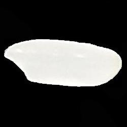

# 🍚 Rice Classification Project 🍚

Welcome to the Rice Classification Project! This project aims to classify five different types of rice based on their images. We have created a classification model that achieved an impressive accuracy of 99.1% on the test dataset. Follow the instructions below to get started!


## 📦 Requirements & Installations

Before you begin, make sure you have the following installed on your machine:

1. [Anaconda](https://linuxhint.com/install-anaconda-ubuntu-22-04/): Ensure you have the latest version of Anaconda installed.
2. [PyTorch](https://installati.one/install-python3-torch-ubuntu-22-04/): Install PyTorch, a deep learning framework.
3. Install additional Python packages: `pandas`, `torchvision`, `matplotlib`.

## 📂 Dataset

To run this code, you need to download the dataset from [this link](https://www.kaggle.com/datasets/muratkokludataset/rice-image-dataset) <!-- [this link](https://drive.google.com/file/d/1eSp5f5ih17blcqjgxJQ1IKx9a7QXTqJT/view?usp=sharing) -->. The folder name of the dataset should be called **Rice_Image_dataset**. Copy and paste it into the project folder, and please **do not change its name**.

## 🚀 Training the Model

Once you have completed the setup, training the model is straightforward. Just run the `model_creator.py` script to train your rice classification model.

```bash
python3 model_creator.py
```

## 🧾 Using the Pretrained Model

If you want to use the pretrained model for inference, follow this example:


```bash
    python3 myScript.py "ImagePath.jpg"
```
| Arborio | Ipsala_rice | ... |
| :---: | :---: | :---: |
|  |  |
|       |      |


## 🧠 Network Architecture

Our model architecture consists of three sets of convolutional layers followed by batch normalization, ReLU activation, and max pooling applied three times. After the convolutional layers, the output is flattened and passed through a dropout layer with a dropout rate of 0.2. Finally, a fully connected layer maps the flattened features to the output classes.

We used the Adam optimizer, which combines adaptive learning rates and momentum for efficient gradient-based optimization.

### Structure

- 3 sets of [CONV >> Batch Normalization >> ReLU Activation >> Max Pooling]
- Adaptive Average Pooling
- Dropout
- Fully Connected Layer

## 🎨 Filters Used

We experimented with different filter sizes and the number of filters:

- Filter Sizes: 5x5, 3x3
- Number of Filters: 16, 32, 64

## 🌟 Achievements

Our model achieved an impressive accuracy of 99.1% on the test dataset, making it highly effective in classifying five different types of rice.

Feel free to explore and adapt this project for your own image classification tasks! If you have any questions or encounter any issues, don't hesitate to reach out for assistance. Enjoy working with the Rice Classification Project! 🌾🍚🤖