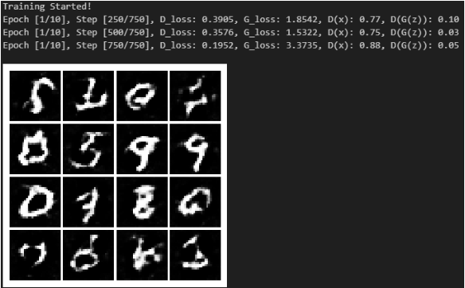
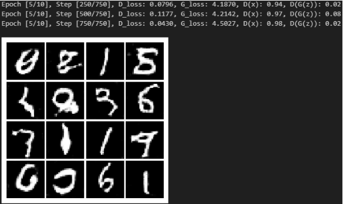
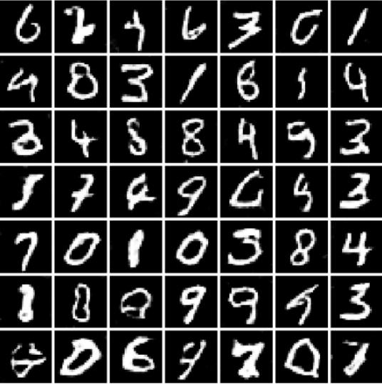
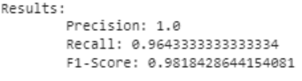
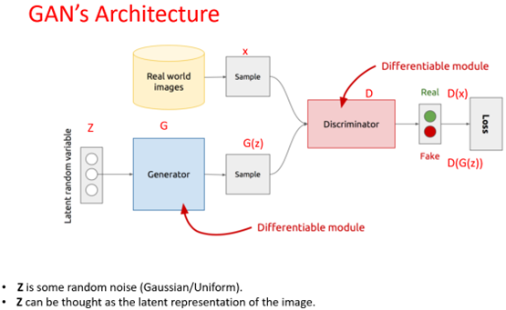

# Generative Adversarial Networks (GAN) for Handwritten Digit Generation 🖼️🤖📊

Welcome to my GAN project for generating realistic handwritten digits using PyTorch and the MNIST dataset! 🎉

## Results

| 1 Epoch | 5 Epochs | ... |
| :---: | :---: | :---: |
|  |  |

| After Training |
| :---: |
|  |
|  |

## Overview 🌟

Generative Adversarial Networks (GANs) are a powerful class of deep learning models used for image generation tasks. This project explores the implementation of a GAN to generate lifelike images of handwritten digits. The GAN comprises two key components: a generator and a discriminator. 🧙‍♂️🕵️‍♂️

### Generator
The **Generator** takes random noise as input and generates fake images that resemble real handwritten digits.

### Discriminator
The **Discriminator** distinguishes between real and fake images, providing feedback to the generator to improve its output.

Through an adversarial training process, the generator learns to produce more convincing images, while the discriminator becomes better at telling real from fake.

## Code Structure Overview 🧩

You can find the complete code, detailed explanations, and results in my Colab notebook (included in the submission). 📚

### Dataset 📦

We use the MNIST dataset, loading it with defined transformations and creating a data loader for batched training.

### GAN Architecture 🏛️

 

### Generator Class 🧪

The generator network architecture:
- 2 * [CONV >> Batch Normalization >> ReLU] >> CONV >> Tanh

Convolutional Transpose Layers:
- The first layer upsamples the input noise, increasing the number of channels to 128.
- Batch normalization enhances training stability.
- ReLU activation adds non-linearity.
- This process repeats with a second convolutional layer, reducing channels to 64.
- The final convolutional transpose layer upscales features to the output size, producing a single-channel image.

### Discriminator Class 🔍

The discriminator network architecture:
- CONV >> LeakyReLU >> CONV >> BatchNorm >> LeakyReLU >> CONV >> Sigmoid

Convolutional Layers:
- The first layer processes single-channel input with 64 filters, reducing spatial dimensions.
- LeakyReLU adds non-linearity.
- The second layer applies 128 filters, further reducing dimensions and increasing channels.
- Batch normalization enhances training stability.
- LeakyReLU activation is applied again.
- The final convolutional layer reduces spatial dimensions to 1x1 to capture global information.
- Sigmoid activation squashes output to a probability score (0 to 1).

### Training 🏋️‍♂️

Instances of the generator and discriminator are created and moved to the specified device. We define binary cross-entropy loss functions and Adam optimizers for training the GAN.

**Training Steps**:
1. Train the discriminator by calculating losses on real and fake images, updating parameters using the optimizer.
2. Train the generator by generating fake images, passing them through the discriminator, calculating losses, and updating parameters.
3. Print progress and losses at regular intervals to monitor training.
4. Display a set of generated images at the end of each epoch.

### Saving & Loading 💾

Finally, I've saved the trained model for future use. I also tested loading the model and presenting the results (full results in the submitted notebook).

Feel free to explore the code and results in the Colab notebook for a deeper understanding of this GAN project! 🚀🔍📝